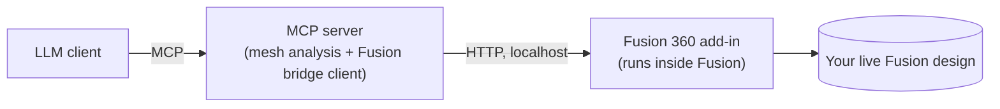

# fusion-reconstruct-mcp

An MCP server that lets an LLM turn an STL/3MF mesh (or a reference photo) into a
**parametric Fusion 360 model** - rebuilt feature by feature (sketches, extrudes,
fillets, patterns...), not imported as a dumb mesh body.

## Why

Slicers (Bambu Studio, PrusaSlicer, ...) only understand STL/3MF: baked triangle meshes.
Fusion 360 only understands parametric feature trees. Importing an STL into Fusion gives
you a solid you can look at but can't meaningfully edit - no parametric dimensions, no
editable sketches, nothing you can push a slider on. This project bridges that gap by
letting an LLM look at the mesh, figure out what it's made of (plates, holes, bosses,
ribs...), and rebuild it as real Fusion features - so you get a model you can actually
resize, add holes to, or otherwise modify the way you would something you built by
hand.

## Scope (read this first)

This targets **mechanical/functional parts** - brackets, enclosures, mounts, plates with
bolt holes, bosses - reconstructed from primitives (extrude, revolve, fillet, chamfer,
pattern, mirror, boolean ops). It does **not** attempt free-form/organic surface
reconstruction; that's a much harder, less reliable problem this project doesn't try to
solve. See [docs/RECONSTRUCTION_STRATEGY.md](docs/RECONSTRUCTION_STRATEGY.md) for the
intended workflow.

## How it works



The MCP server exposes two families of tools:

- **`mesh_summary`, `find_circular_holes`, `find_circular_faces`, `list_planar_facets`,
  `get_cross_section`, `render_orthographic_views`, `compare_meshes`** - pure mesh
  analysis (`trimesh`), no Fusion required. Used to understand the input file and to
  check the reconstruction's accuracy against it afterwards.
- **`fusion_*`** (create sketch, add line/circle/rectangle/arc, extrude, revolve, fillet,
  chamfer, pattern, mirror, combine, set/list parameters, export, screenshot, ...) - talk
  to a companion Fusion 360 add-in over `http://127.0.0.1:6172`, which executes them
  against the real `adsk.fusion` API inside a running Fusion session.

See [docs/ARCHITECTURE.md](docs/ARCHITECTURE.md) for why it's split this way (short
version: Fusion's API only runs inside Fusion's own process, on its main thread, with no
pip access - so the add-in has to be a small stdlib-only HTTP bridge).

## Setup

See [docs/SETUP.md](docs/SETUP.md) for full instructions. Short version:

```bash
git clone https://github.com/<your-username>/fusion-reconstruct-mcp.git
cd fusion-reconstruct-mcp
python -m venv .venv && source .venv/bin/activate  # .venv\Scripts\activate on Windows
pip install -r requirements.txt
```

Then copy `fusion_addin/FusionReconstructBridge/` into Fusion's `AddIns` folder and start
it from `Utilities > Add-Ins > Scripts and Add-Ins`, and point your MCP client
(`claude mcp add ...` or your `mcp.json`) at `python -m server.mcp_server` in this repo.

## Usage

With Fusion running and the add-in started, ask your LLM client something like:

> Reconstruct `~/Downloads/bracket.stl` as a parametric Fusion 360 model, then export it
> and check how close it is to the original.

It will inspect the mesh, look at rendered views, locate holes/bosses, rebuild the part
feature by feature in Fusion, and validate the result by exporting and diffing against
the source mesh. For a photo instead of a mesh, it builds a first pass from your
description/the image and refines it interactively with you - there's no ground-truth
dimension data in a single photo, so treat that path as "assisted modeling," not
"scan-to-CAD."

## Status / limitations

- Circle/hole detection is a mesh-tessellation heuristic (facet outline circle-fitting)
  - it works well on typical printable parts but isn't a general feature-recognition
    engine.
  - Photo-based reconstruction estimates proportions; it does not measure real-world
  dimensions from a single image.
- `render_orthographic_views` uses a plain `matplotlib` wireframe/solid renderer (no GPU
  dependency) - good enough to see overall shape, not photorealistic, and can show minor
  z-ordering artifacts on complex parts.
- One Fusion document/bridge connection at a time.
- Built and smoke-tested against `mcp>=2.0.0`'s `MCPServer` API. The Fusion-side actions
  have all been exercised against a real, running Fusion 360 session (not just written
  against the docs) - see `tests/smoke_test_fusion_live.py` (sketch → extrude →
  cut/join → export, verified against the original mesh to within 0.01mm) and
  `tests/smoke_test_fusion_live_features.py` (fillet, chamfer, mirror, circular
  pattern, revolve, explicit combine). `sketch_add_line`, `sketch_add_arc_three_point`
  and `pattern_rectangular` share code paths with tested siblings but don't have their
  own dedicated live test yet. None of this runs in CI (there's no headless Fusion) -
  issues/PRs against `fusion_addin/` very welcome regardless.

## License

MIT - see [LICENSE](LICENSE).
