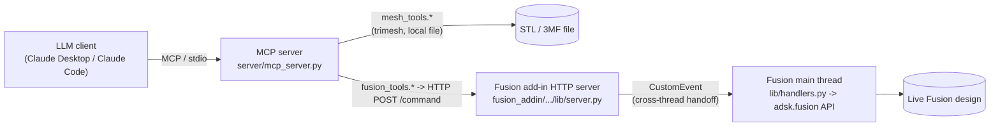

# Architecture

Three pieces, deliberately kept separate because they run in different processes with
different constraints:

## 1. `server/mesh_tools.py` - mesh analysis (no Fusion needed)

Pure Python (`trimesh`, `numpy`, `matplotlib`). Reads an STL/3MF file and answers
questions about it: bounding box, volume, flat-facet list, circular hole/boss
detection, arbitrary-plane cross-sections, orthographic renders, and a surface-distance
comparison against a candidate reconstruction. Nothing here touches Fusion - you could
use this module on its own.

## 2. `server/fusion_tools.py` + `fusion_client.py` - the MCP-side half of the bridge

Thin wrappers that POST `{"action": ..., "params": ...}` to
`http://127.0.0.1:6172/command` and return the JSON result. One function per Fusion
operation (create a sketch, extrude, fillet, pattern, export...). This is what turns
into MCP tools in `mcp_server.py`.

## 3. `fusion_addin/FusionReconstructBridge` - the Fusion-side half

Runs *inside* Fusion 360's own Python process as an add-in, because that's the only way
to reach the `adsk.fusion` API at all - there is no separate/headless Fusion API server.
Two things make this non-trivial:

- **No pip access.** Fusion's embedded interpreter can't install third-party packages,
  so this side is stdlib-only (`http.server`, `threading`, `queue`, `json`, `math`).
- **The Fusion API is main-thread-only.** The HTTP server has to run on a background
  thread (so it doesn't block Fusion's UI), but every `adsk.fusion` call it triggers has
  to happen on the main thread. `lib/thread_bridge.py` does this with the
  Autodesk-documented pattern: register a `CustomEvent`, and firing it from any thread
  causes Fusion to invoke your handler on the main thread on its next event-loop tick.
  Each HTTP request enqueues `(action, kwargs, result_box, done_event)`, fires the
  event, and blocks on `done_event` until `lib/handlers.py` has run the action and
  filled in the result (or raised).

## Identifying things across calls: `entityToken`

A reconstruction is many small tool calls (create sketch, add circle, extrude, fillet,
...) spread across many HTTP round-trips. Rather than keep a separate id-to-object
registry on the add-in side (which would go stale on undo/redo, document switches, or
an add-in reload), every sketch/body/feature is identified by Fusion's own
`entityToken` - a string every design entity already exposes, and resolvable back to
the live object at any time via `Design.findEntityByToken(token)`. That's what
`body_id`, `sketch_id`, and `feature_id` are throughout the tool surface.

## Units

The Fusion API's internal length unit is always centimeters, no matter what the
document displays. Every tool in this project works in **millimeters** instead (matching
STL/3D-printing convention), and converts at the `fusion_addin` boundary
(`handlers.py`'s `_mm_to_cm`/`_cm_to_mm`). Parametric feature inputs (extrude distance,
fillet radius, pattern spacing, angles) are sent as `ValueInput.createByString("<n> mm")`
so they land in Fusion's timeline as ordinary, human-editable expressions - not raw,
opaque numbers.

## Design choice: no dedicated "hole" feature

Fusion has a `HoleFeature` API, but this project deliberately doesn't wrap it. A hole is
built the same way as everything else: sketch a circle, then `fusion_extrude(...,
operation="cut")`. That keeps the tool surface small and every hole fully parametric
(diameter and depth are ordinary sketch/feature values) without a second, parallel code
path to maintain.
